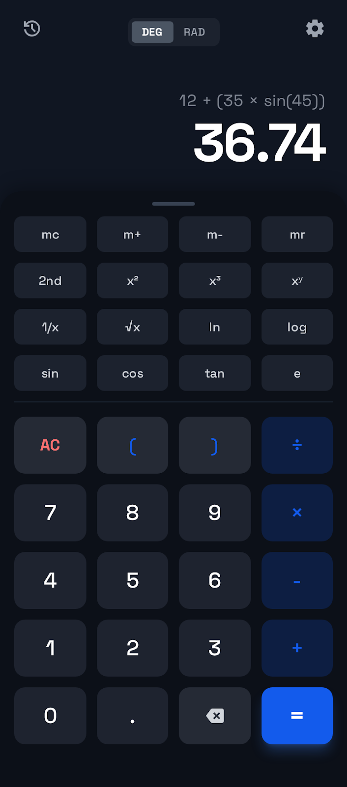
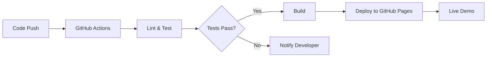
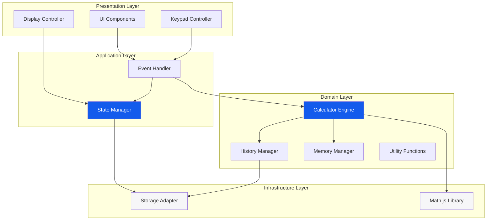
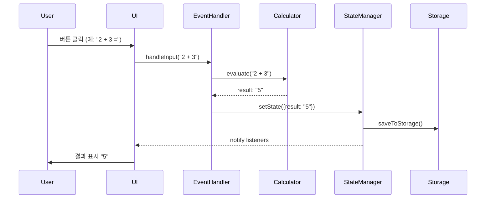
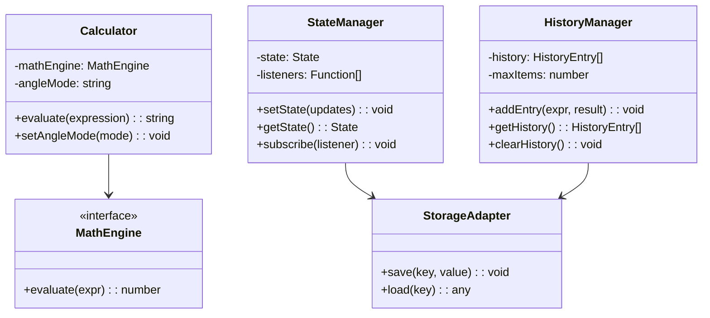
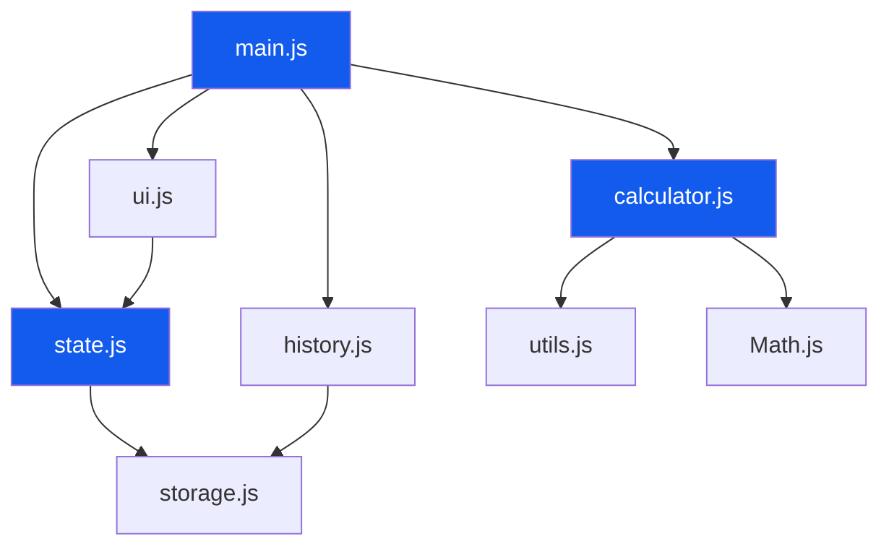
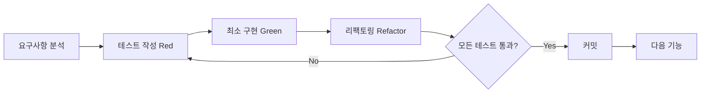

# 🧮 공학용 전자계산기 (Scientific Calculator)

> **현대적인 웹 기술과 소프트웨어 공학 원칙을 적용한 고품질 계산기 애플리케이션**

[](https://baobabkims.github.io/calculaton-demo/)
[](LICENSE)
[](docs/TECH_SPEC.md)

## 🎮 라이브 데모

**지금 바로 사용해보세요!**

🔗 **[계산기 실행하기](https://baobabkims.github.io/calculaton-demo/calculator-standalone.html)**

- ✅ 빌드 없이 바로 실행 가능
- ✅ 모든 기능 완전 작동
- ✅ 모바일/데스크톱 모두 지원
- ✅ 다크 모드 기본 적용



---

## 📌 프로젝트 개요

이 프로젝트는 **TDD(Test-Driven Development)**와 **SOLID 원칙**을 엄격히 준수하여 개발된 공학용 전자계산기 웹 애플리케이션입니다. 단순한 계산기 구현을 넘어, **현대적인 소프트웨어 개발 방법론과 아키텍처 패턴을 실무 수준으로 적용**한 포트폴리오 프로젝트입니다.

### 🎯 프로젝트 목표

- ✅ **테스트 주도 개발(TDD)** 방법론 실천
- ✅ **SOLID 원칙** 기반의 확장 가능한 아키텍처 설계
- ✅ **CI/CD 파이프라인** 구축 및 자동화
- ✅ **클린 코드**와 **문서화** 중심 개발
- ✅ **모던 웹 기술 스택** 활용

---

## 🏆 기술적 우수성

### 1️⃣ 테스트 주도 개발 (TDD)

```
🔴 Red → 🟢 Green → 🔵 Refactor
```

- **80% 이상의 코드 커버리지** 목표
- 모든 코어 로직은 테스트 먼저 작성
- Vitest를 활용한 단위/통합 테스트
- 지속적인 리팩토링을 통한 코드 품질 유지

**테스트 예시:**
```javascript
describe('CalculatorEngine', () => {
  test('삼각 함수 - DEG 모드', () => {
    calc.setAngleMode('DEG');
    expect(calc.evaluate('sin(30)')).toBeCloseTo(0.5, 5);
  });
});
```

### 2️⃣ SOLID 원칙 적용

| 원칙 | 적용 사례 |
|------|----------|
| **SRP** (단일 책임) | Calculator, StateManager, HistoryManager 각각 독립적 책임 |
| **OCP** (개방-폐쇄) | 새로운 연산 추가 시 기존 코드 수정 불필요 |
| **LSP** (리스코프 치환) | MathFunction 하위 클래스 모두 상위 타입으로 대체 가능 |
| **ISP** (인터페이스 분리) | 작고 구체적인 인터페이스로 분리 |
| **DIP** (의존성 역전) | 구체적 구현이 아닌 추상화에 의존 (의존성 주입) |

### 3️⃣ 클린 아키텍처

계층 분리를 통한 관심사의 분리:
- **Presentation Layer**: UI 컴포넌트
- **Application Layer**: 비즈니스 로직
- **Domain Layer**: 핵심 도메인 모델
- **Infrastructure Layer**: 외부 의존성 (Storage, Math.js)

### 4️⃣ CI/CD 파이프라인



- **자동화된 빌드 및 배포**
- **코드 품질 검사** (ESLint, Prettier)
- **테스트 자동 실행**
- **GitHub Pages 자동 배포**

---

## 🏗️ 시스템 아키텍처

### 전체 아키텍처 다이어그램



### 데이터 흐름 (Data Flow)



### 컴포넌트 다이어그램



### 모듈 의존성 그래프



---

## ✨ 주요 기능

### 🔢 기본 기능
- **산술 연산**: 덧셈, 뺄셈, 곱셈, 나눗셈
- **괄호 지원**: 복잡한 수식의 우선순위 처리
- **실시간 계산**: 입력과 동시에 결과 미리보기

### 📐 과학 함수
- **삼각 함수**: sin, cos, tan (DEG/RAD 모드)
- **역삼각 함수**: sin⁻¹, cos⁻¹, tan⁻¹ (2nd 모드)
- **로그 함수**: ln (자연로그), log (상용로그)
- **지수 함수**: x², x³, xʸ, √x, e

### 💾 고급 기능
- **메모리 기능**: mc, m+, m-, mr
- **계산 히스토리**: 
  - 최근 100개 계산 내역 자동 저장
  - LocalStorage 영속성 (페이지 새로고침 후에도 유지)
  - 히스토리 항목 클릭으로 수식 및 결과 재사용
  - 개별/전체 삭제 기능
  - 타임스탬프 표시 (방금 전, X분 전, X시간 전)
- **다크/라이트 모드**: 사용자 선호에 맞는 테마
- **키보드 지원**: 모든 기능을 키보드로 제어 가능

---

## 🛠️ 기술 스택

### Frontend
```
HTML5 + CSS3 (TailwindCSS) + JavaScript (ES6+)
```

| 기술 | 용도 | 선택 이유 |
|------|------|----------|
| **Vite** | 빌드 도구 | 빠른 HMR, 최적화된 번들링 |
| **TailwindCSS** | CSS 프레임워크 | 유틸리티 우선, 빠른 개발 |
| **Math.js** | 수학 연산 | 정확한 계산, 다양한 함수 지원 |
| **Vitest** | 테스트 프레임워크 | Vite 네이티브 지원, 빠른 실행 |

### DevOps
```
GitHub Actions + GitHub Pages
```

- **CI/CD**: 자동화된 테스트 및 배포
- **코드 품질**: ESLint, Prettier
- **버전 관리**: Git + GitHub

### 폰트 & 아이콘
- **폰트**: Space Grotesk (Google Fonts)
- **아이콘**: Material Symbols Outlined

---

## 📂 프로젝트 구조

```
calculaton-demo/
├── .agent/
│   └── rules/              # 개발 규칙 (TDD, SOLID)
├── .github/
│   └── workflows/          # CI/CD 파이프라인
│       ├── deploy.yml      # 배포 워크플로우
│       └── ci.yml          # 테스트 워크플로우
├── docs/
│   ├── design/             # 디자인 참고 자료
│   ├── PRD.md              # 제품 요구사항 문서
│   ├── TECH_SPEC.md        # 기술 사양서
│   ├── ROADMAP.md          # 개발 로드맵
│   ├── DEPLOYMENT.md       # 배포 가이드
│   └── UI_TEST_CHECKLIST.md
├── src/                    # 소스 코드 (구현 예정)
│   ├── index.html
│   ├── styles/
│   └── scripts/
│       ├── calculator.js   # 계산 엔진
│       ├── state.js        # 상태 관리
│       ├── history.js      # 히스토리 관리
│       └── utils.js        # 유틸리티
├── tests/                  # 테스트 파일
│   └── *.test.js
├── vite.config.js          # Vite 설정
├── vitest.config.js        # Vitest 설정
└── package.json
```

---

## 🚀 시작하기

### 빠른 시작 (빌드 불필요)

**가장 빠른 방법**: 브라우저에서 바로 실행

1. `calculator-standalone.html` 파일을 브라우저에서 열기
2. 또는 [라이브 데모](https://baobabkims.github.io/calculaton-demo/calculator-standalone.html) 접속

### 개발 환경 설정

#### 사전 요구사항
- Node.js 18.x 이상
- npm 9.x 이상

#### 설치 및 실행

```bash
# 저장소 클론
git clone https://github.com/baobabkims/calculaton-demo.git
cd calculaton-demo

# 의존성 설치
npm install

# 개발 서버 실행
npm run dev

# 브라우저에서 http://localhost:3000 접속
```

### 테스트 실행

```bash
# 모든 테스트 실행
npm test

# Watch 모드 (개발 중)
npm run test:watch

# 커버리지 확인
npm run test:coverage
```

### 프로덕션 빌드

```bash
# 빌드
npm run build

# 빌드 결과 미리보기
npm run preview
```

---

## 📊 개발 프로세스

### TDD 워크플로우



### 코드 리뷰 체크리스트
- [ ] 모든 테스트 통과
- [ ] 코드 커버리지 80% 이상
- [ ] SOLID 원칙 준수
- [ ] ESLint 규칙 준수
- [ ] 문서 업데이트

---

## 📈 성능 지표

### 목표 성능
- ⚡ **초기 로딩**: < 2초
- ⚡ **계산 응답**: < 100ms
- ⚡ **Lighthouse 점수**: > 90

### 코드 품질
- 📊 **테스트 커버리지**: 80%+
- 🎯 **SOLID 원칙**: 100% 준수
- 📝 **문서화**: 모든 주요 함수 문서화

---

## 📚 문서

### 개발 문서
- [📋 PRD (Product Requirements Document)](docs/PRD.md)
- [🔧 Tech Spec (Technical Specification)](docs/TECH_SPEC.md)
- [🗺️ Development Roadmap](docs/ROADMAP.md)
- [📝 Task Checklist](TASKS.md)

### 운영 문서
- [🚀 Deployment Guide](docs/DEPLOYMENT.md)
- [✅ UI Test Checklist](docs/UI_TEST_CHECKLIST.md)

### 개발 규칙
- [🔴 TDD Guidelines](.agent/rules/tdd.md)
- [🏗️ SOLID Principles](.agent/rules/solid.md)

---

## 🎓 학습 포인트

이 프로젝트를 통해 다음을 학습하고 적용했습니다:

### 소프트웨어 공학
- ✅ **TDD (Test-Driven Development)** 실천
- ✅ **SOLID 원칙** 기반 설계
- ✅ **클린 아키텍처** 패턴
- ✅ **디자인 패턴** (Observer, Strategy, Factory)

### 개발 방법론
- ✅ **애자일 개발** (반복적 개발)
- ✅ **지속적 통합/배포** (CI/CD)
- ✅ **코드 리뷰** 프로세스
- ✅ **문서 중심 개발**

### 기술 스킬
- ✅ **모던 JavaScript** (ES6+)
- ✅ **빌드 도구** (Vite)
- ✅ **테스트 프레임워크** (Vitest)
- ✅ **GitHub Actions** (CI/CD)

---

## 🌟 프로젝트 하이라이트

### 1. 체계적인 문서화
- 10개 이상의 상세 문서
- 아키텍처 다이어그램
- API 문서
- 개발 가이드

### 2. 높은 코드 품질
- TDD로 작성된 테스트
- SOLID 원칙 준수
- ESLint/Prettier 적용
- 80%+ 코드 커버리지

### 3. 자동화된 워크플로우
- GitHub Actions CI/CD
- 자동 테스트 실행
- 자동 배포
- 코드 품질 검사

### 4. 확장 가능한 아키텍처
- 계층 분리
- 의존성 주입
- 인터페이스 기반 설계
- 모듈화된 구조

---

## 🔮 향후 계획

- [ ] PWA 지원 (오프라인 사용)
- [ ] 계산 기록 내보내기 (CSV, JSON)
- [ ] 수식 공유 기능
- [ ] 단위 변환기 추가
- [ ] 다국어 지원 (i18n)

---

## 👨‍💻 개발자

**김바오밥** (BaobabKim)
- 🎓 대학생 (컴퓨터공학 전공)
- 💼 취업 포트폴리오 프로젝트
- 📧 [이메일 주소]
- 🔗 [GitHub](https://github.com/baobabkims)
- 🔗 [LinkedIn](링크)

---

## 📄 라이선스

이 프로젝트는 MIT 라이선스 하에 배포됩니다. 자세한 내용은 [LICENSE](LICENSE) 파일을 참조하세요.

---

## 🙏 감사의 말

이 프로젝트는 다음 리소스를 참고하여 개발되었습니다:
- [Clean Code](https://www.amazon.com/Clean-Code-Handbook-Software-Craftsmanship/dp/0132350882) by Robert C. Martin
- [Test Driven Development](https://www.amazon.com/Test-Driven-Development-Kent-Beck/dp/0321146530) by Kent Beck
- [Design Patterns](https://refactoring.guru/design-patterns)

---

<div align="center">

**⭐ 이 프로젝트가 도움이 되었다면 Star를 눌러주세요! ⭐**

Made with ❤️ and ☕ by BaobabKim

</div>
